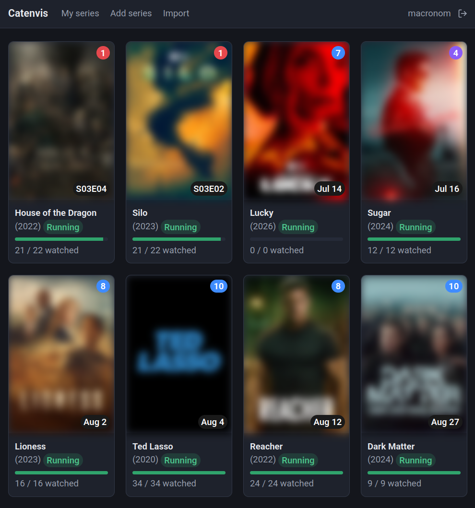

# 📺 Catenvis

**Keep track of your TV series — and never miss a new episode.**

A small, self-hosted web app to follow shows, mark episodes and seasons as
watched, and see at a glance which series have new episodes waiting.

  

Series and episode data comes from [TMDB](https://www.themoviedb.org/).

  

> This product uses the TMDB API but is not endorsed or certified by TMDB.

## Features

- Follow series and track watched episodes per user
- Dashboard sorted by progress, with a badge for unseen aired episodes
- Mark single episodes, whole seasons, or a series as watched — including a
  one-click "watched" action right on the dashboard card
- Defer series you want to keep but watch later ("on hold")
- Add series via TMDB search; bulk import from an IMDb CSV export
- Multilingual content **and** interface (English, German, French, Spanish,
  Italian) with per-user language; the UI language is easy to extend via flat
  JSON catalogs in `lang/`
- Admin-managed accounts with forced first-login password change and
  brute-force protection on the login
- Daily background refresh of new episodes via cron

## Requirements

- PHP 8.3+ (extensions: `pdo_mysql`, `curl`)
- MySQL / MariaDB
- Apache with `mod_rewrite`
- A TMDB API key (v4 read access token or v3 API key)

## Installation

1. **Dependencies:** run `composer install`.
2. **Database:** create an empty database and a user for it — the exact
   `CREATE DATABASE` / `CREATE USER` / `GRANT` statements are in the header of
   [`sql/schema.sql`](sql/schema.sql).
3. **Guided setup:** run `php bin/setup.php`. It asks for the database and TMDB
   credentials, writes `config/config.php`, loads the schema and creates the
   first admin account — all options are documented in
   `config/config.sample.php`.
4. **Web server & cron:** point the web root at `html/` and set up the daily
   update cron. A full walkthrough is in [`deploy/SETUP.md`](deploy/SETUP.md).

**Updating:** after pulling a new version, apply pending schema changes with
`php bin/migrate.php` (idempotent; see
[`sql/migrations/README.md`](sql/migrations/README.md)).

## Translations

UI translations are flat JSON files in `lang/` (English is the source
language and needs no file). To add a language, copy `lang/de.json` to
`lang/<code>.json`, set its `"__language__"` label, and translate the values;
it appears in the settings automatically. Check completeness with
`php bin/check_translations.php`. See [`lang/README.md`](lang/README.md).

## License

Catenvis is free software, licensed under the
[GNU General Public License v3.0](LICENSE).
</content>
</invoke>
